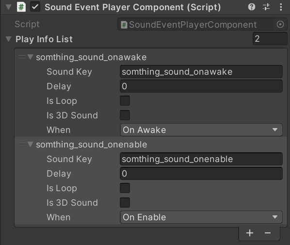

# unity-manage-resource

[](https://opensource.org/licenses/MIT)

## 소개

유니티 내 리소스(이펙트, 사운드 등)을 관리하는 라이브러리입니다.
이펙트는 현재 작업중입니다.

## 기능

- 컴포넌트로 사운드 재생
  
- 코드 내 사운드 재생

```csharp
public void PlaySound()
{
    SoundSystem.manager
        .GetSlot("soundkey")
        .SetDelay(0f)
        .PlayResource();
}
```

## 사용법

1. SoundManagerComponent 인스턴스를 생성합니다.
2. ISoundData를 구현한 데이터 클래스를 SoundManagerComponent 인스턴스에 Add합니다.
3. 사운드를 플레이합니다.

```csharp
// 예시 코드
void Awake()
{
    SoundManagerComponent.instance.AddData(datas);
    SoundSystem.manager
        .GetSlot("soundkey")
        .SetDelay(0f)
        .PlayResource();
}
```

## 설치

Unity Editor/상단 Window 탭/Package Manager/+ 버튼/‌

Add package from git URL 클릭 후‌

이 저장소의 URL 입력‌
​[https://github.com/unity-korea-community/unity-manage-resource.git](https://github.com/unity-korea-community/unity-manage-resource.git)
